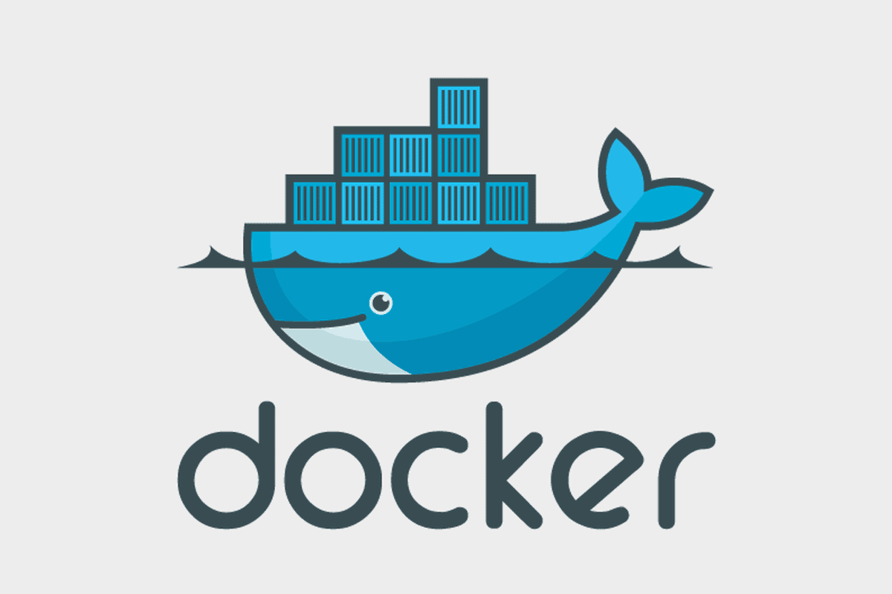

# Boas-vindas ao repositório do projeto API Store Manager

<p align="center">
  
  
  
  
</p>

Este é um projeto desenvolvido como parte do curso de Desenvolvimento Full Stack da Trybe. O Store Manager é uma aplicação que gerencia produtos e vendas em uma loja, oferecendo endpoints para listar, cadastrar, atualizar e deletar produtos e vendas.

A aplicação foi desenvolvida utilizando Node.js e express.js para o backend e MySQL como banco de dados. Ela fornece uma API RESTful que permite aos usuários realizar operações CRUD (Create, Read, Update, Delete) em produtos e vendas.

## 🐳 Docker

O Docker foi utilizado neste projeto para facilitar a configuração e execução do ambiente de desenvolvimento. Com o Docker, é possível encapsular a aplicação, suas dependências e o banco de dados em contêineres isolados, garantindo que ela possa ser executada de maneira consistente em diferentes ambientes.

O arquivo docker-compose.yml define a configuração dos contêineres necessários para o projeto, incluindo o contêiner do banco de dados MySQL e o contêiner da aplicação Node.js. Com um único comando, os contêineres podem ser inicializados, permitindo que o ambiente de desenvolvimento seja configurado de forma rápida e fácil.

## Tecnologias Utilizadas

[Node JS](https://nodejs.org/en/docs)

[JavaScript](https://developer.mozilla.org/pt-BR/docs/Web/JavaScript)

[Docker](https://www.docker.com/get-started/)

[MySQL](https://www.mysql.com/)

[Express JS](https://expressjs.com/pt-br/)

[Mocha](https://mochajs.org/#getting-started)

## Índice

- [Ambiente de Desenvolvimento](#requisitos)
- [Instalação](#instalação)
- [Uso](#uso)
- [Estrutura do Projeto](#estrutura-do-projeto)
- [Contato](#contato)
- [Licença](#licença)

## Ambiente de Desenvolvimento

Para desenvolver e executar esta aplicação, é necessário configurar um ambiente com as seguintes ferramentas:

**Docker**: Utilizamos o Docker para empacotar e isolar a aplicação em contêineres, garantindo uma implantação consistente e fácil gerenciamento de dependências.

- [Como instalar o docker](https://docs.docker.com/engine/install/ubuntu/)

**Node.js**: A aplicação é desenvolvida em Node.js, uma plataforma de tempo de execução JavaScript, e é necessária para executar o código.

- [Como instalar o Node.js](https://nodejs.org/en/download/package-manager)

**Docker Compose**: O Docker Compose é uma ferramenta que simplifica a definição e o gerenciamento de serviços multi-contêiner em um único arquivo, ideal para orquestrar contêineres relacionados à aplicação.

- [Como instalar o Docker-Compose](https://docs.docker.com/compose/install/)

Certifique-se de instalar e configurar essas ferramentas em seu ambiente de desenvolvimento antes de iniciar o projeto.

## Instalação

Clone este repositório:

   ```bash
   git clone git@github.com:ElieltonRamos/project-api-store-manager.git
   ```

Navegue até o diretório do projeto:

   ```bash
cd project-api-store-manager
   ```

Instale as dependências:

   ``` bash
npm install
   ```

Inicie o docker compose:

   ``` bash
docker compose up -d --build
   ```

Inicie a aplicação:

  O container do node ja esta configurado para deixar a apricação online automaticamente, caso queira ver os logs da apricação, execute o seguinte comando

   ``` bash
docker logs -f store_manager
   ```

## Testes

O projeto conta com testes que verificam o funcionamento de cada rota da API, os testes foram escritos com a biblioteca MOCHA, nao e necessario que o docker compose tenha sido executado para que os testes funcionem, cada teste esta isolado com stubs(mocks).

Para executar os testes siga os seguintes passos:

Abra o terminal na raiz do projeto

Execute o comando:

   ``` bash
npm test
   ```

Verifique a saida dos testes no seu terminal

O projeto apresenta uma cobertura de testes de 100% das funções criadas, para verificar isso, você pode executar o seguinte comando:
   ``` bash
npm run test:coverage
   ```

## Uso

Explore as rotas essenciais desta API, operações de CRUD e funcionalidades de pesquisa para uma administração eficaz de vendas e produtos.

1. **Listar Produtos**

Endpoint: GET /products e GET /products/:id
Descrição:
GET /products retorna todos os produtos ordenados por ID crescente.
GET /products/:id retorna apenas o produto com o ID especificado.
Testes: Deve ser testada a funcionalidade de listagem de todos os produtos e de um produto específico.

2. **Listar Vendas**

Endpoint: GET /sales e GET /sales/:id
Descrição:
GET /sales retorna todas as vendas ordenadas por saleId e productId.
GET /sales/:id retorna apenas a venda com o ID especificado.
Testes: Devem garantir que as vendas sejam listadas corretamente e que a ordem de classificação seja conforme especificado.

3. **Cadastrar Produtos**

Endpoint: POST /products
Descrição:
Cria um novo produto no banco de dados com base nos dados fornecidos no corpo da requisição.
Testes: Devem validar se o produto é criado corretamente no banco de dados.

4. **Validações para o Cadastro de Produtos**

Descrição:
Deve retornar mensagens de erro para requisições com dados inválidos.
Testes: Devem garantir que as validações ocorram corretamente.

5. **Cadastrar Vendas**

Endpoint: POST /sales
Descrição:
Cria uma nova venda no banco de dados com base nos dados fornecidos no corpo da requisição.
Testes: Devem validar se a venda é criada corretamente no banco de dados.

6. **Validações para o Cadastro de Vendas**

Descrição:
Deve retornar mensagens de erro para requisições com dados inválidos.
Testes: Devem garantir que as validações ocorram corretamente.

7. **Atualizar um Produto**

Endpoint: PUT /products/:id
Descrição:
Atualiza as informações de um produto com o ID especificado no banco de dados.
Testes: Devem garantir que as informações do produto sejam atualizadas corretamente.

8. **Deletar um Produto**

Endpoint: DELETE /products/:id
Descrição:
Remove um produto com o ID especificado do banco de dados.
Testes: Devem garantir que o produto seja removido corretamente do banco de dados.

9. **Deletar uma Venda**

Endpoint: DELETE /sales/:id
Descrição:
Remove uma venda com o ID especificado do banco de dados.

10. **Atualizar a Quantidade de um Produto em uma Venda**

Endpoint: /sales/:saleId/products/:productId/quantity
Descrição:
Atualiza a quantidade de um produto vendido na venda especificada.

11. **Pesquisar Produtos**

Endpoint: GET /products/search
Descrição:
Retorna todos os produtos no banco de dados que contenham o termo especificado em seus nomes.
Testes: Devem garantir que a pesquisa funcione corretamente, incluindo casos em que nenhum produto seja encontrado.

## Estrutura do Projeto

A seguir esta explicada a estrutura de pastas do projeto

project-api-store-manager/ : A pasta raiz do projeto.<br>
├── node_modules/ : Contém as dependências da aplicação.<br>
├── tests/ : Contém os testes do projeto.<br>
├── src/ : O diretório principal do código-fonte da aplicação, onde estão localizados todas as camadas da apricação e o arquivo do servidor<br>
│   ├── middlewares/<br>
│   ├── models/<br>
│   ├── routes/<br>
│   ├── services/<br>
│   ├── controllers/<br>
│   ├── utils/<br>
│   ├── app.js: Arquivo que configura o express/<br>
│   ├── server.js: Arquivo que inicia o express/<br>
├── package.json : Descreve as dependências e configurações do projeto.<br>
├── README.md : A documentação do projeto.<br>
├── docker-compose.yml : Utilizado para configurar e executar a aplicação em contêineres Docker.<br>
├── DockerFile : Contém instruções para a criação de uma imagem Docker para a aplicação.<br>
├── sql : Um arquivo SQL usado para preencher o banco de dados com dados iniciais.<br>
├── images-readme : Pasta contendo imagens do readme.<br>
├── .mocharc.json : Configurações para testes com o framework mocha.<br>
├── .dockerignore : Configuração para que o docker ignore alguns arquivos.<br>
├── .gitignore : Configuração para que o git(Git Hub) ignore alguns arquivos.<br>
├── .eslintrc.json : Configuração do linter, biblioteca para manter padrão de codico.<br>

## Contato

Elielton Ramos

[](mailto:elieltonramos14@gmail.com)
[](https://www.linkedin.com/in/elielton-ramos/)

## Contribuição

Este projeto foi desenvolvido durante meu curso na [Trybe](https://www.betrybe.com/) com base no projeto 'Store Manager'. A Trybe é uma escola de programação que tem compromisso com o sucesso profissional. O projeto 'Store Manager' é parte do módulo de Back-End e envolve a criação de uma API com Express, Node, Docker e MySQL.

## Licença

Código Aberto (Open Source)

Este projeto é de código aberto e está disponível para toda a comunidade. Fique à vontade para explorar, clonar e contribuir para o projeto.

## Agradecimentos

Sou grato à [Trybe](https://www.betrybe.com/) por proporcionar esse desafio enriquecedor e pela oportunidade de aprimorar minhas habilidades como desenvolvedor. Estou empolgado para aplicar os conhecimentos adquiridos em projetos futuros e continuar minha jornada de desenvolvedor web.
